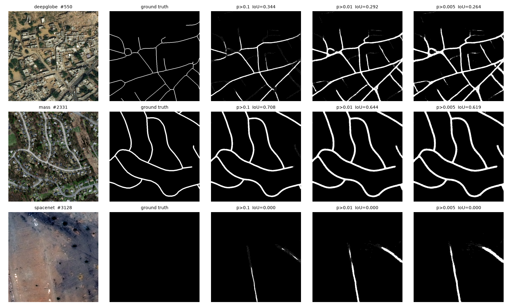
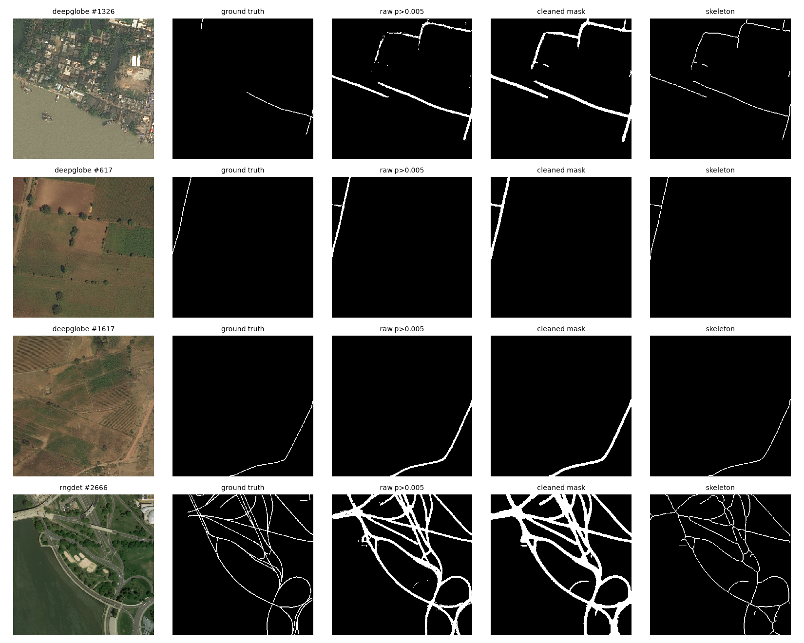

# Road Segmentation — D-LinkNet34

A D-LinkNet34 (ResNet34 encoder + dilated-convolution center block + additive
LinkNet decoder) trained from scratch to segment roads in satellite/aerial
imagery, on a unified 512x512 corpus built from four public road datasets
(64,979 patches total). Includes a post-processing pipeline (denoise, close,
skeletonize) to turn the raw probability map into a clean centerline graph.

Built during a deep learning internship project — see [`notebook.ipynb`](notebook.ipynb)
for the full, ordered pipeline (train -> postprocess -> evaluate -> compare).

## Results

Evaluated on a held-out test split (3,175 patches) with relaxed
precision/recall/F1 on skeletons at a 3px tolerance (Mnih & Hinton metric):

| dataset   | patches | precision | recall | F1     |
|-----------|--------:|----------:|-------:|-------:|
| deepglobe |   2,137 |    0.6615 | 0.8591 | 0.7474 |
| mass      |     441 |    0.6928 | 0.8518 | 0.7641 |
| rngdet    |     432 |    0.6231 | 0.7756 | 0.6910 |
| spacenet  |     165 |    0.4563 | 0.5515 | 0.4994 |
| **ALL**   |   3,175 |    0.6433 | 0.8135 | 0.7185 |

Trained for 30 epochs (55,500 steps, batch 32) on an RTX 5060 8GB, reaching a
best validation balanced relaxed-F1 of 0.887 at ~144 img/s.




## Project layout

```
.
├── notebook.ipynb          # the project end-to-end: train, postprocess, evaluate, compare
├── src/
│   ├── dlinknet.py                  # D-LinkNet34 model definition
│   ├── road_dataset.py              # Dataset + augmentation + normalization
skeleton
│   └── visualize_predictions.py     # standalone: qualitative prediction grid
├── results/                 # sample output figures
├── requirements.txt
└── data/, unified_dataset/, trained_models/   # not tracked in git
```


## Data

The unified corpus merges four public road
datasets, normalized to 512x512 RGB PNGs + binary masks:

| dataset | expected path | source |
|---|---|---|
| DeepGlobe Road Extraction | `data/deepglobe/root/{train,val,test}/{images,masks}/` | [DeepGlobe Road Extraction Challenge](https://competitions.codalab.org/competitions/18467) (mirrored on [Kaggle](https://www.kaggle.com/datasets/balraj98/deepglobe-road-extraction-dataset)) |
| Massachusetts Roads | `data/mass/tiff/{train,val,test}/` + `{split}_labels/` | [Mass. Roads Dataset](https://www.cs.toronto.edu/~vmnih/data/) (Mnih), also mirrored on Kaggle |
| RNGDet / City-scale | `data/rngdet/{train,valid,test}/region_<id>_{sat,gt}.png` | the "city-scale" road network dataset used by the RNGDet / Sat2Graph papers (search for "RNGDet city-scale dataset" — download link is distributed via the paper authors' repo) |
| SpaceNet 3 (AOI 5 — Khartoum) | `data/AOI_5_Khartoum/{PS-RGB,geojson_roads}/` | [SpaceNet Roads Challenge, AOI 5](https://spacenet.ai/spacenet-roads-dataset/) |